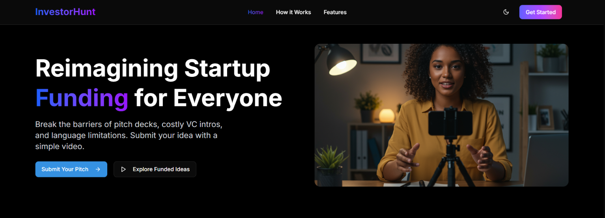

# 💼💡 InvestorHunt - "Where Ideas Meet Investors” 



 Reimagining startup funding for everyone, everywhere. Break the barriers of pitch decks, costly VC intros, and language limitations by submitting your startup idea with a simple video.

## 🌟 Key Features

- 🤖 **AI Pitch Analyzer**: Evaluates your pitch for clarity, uniqueness, and market fit
- 🎥 **Video Pitch Submissions**: Upload a 3–4 min pitch and receive instant AI feedback
- 🌐 **Multilingual Support**: Submit in your native language—AI handles the translation
- 💬 **Community Feedback**: Get real-time insights from other founders and early backers
- 🤝 **Investor Matching**: Get directly connected with interested investors
- 📊 **Analytics Dashboard**: Track your pitch’s performance and investor engagement
- 📬 **Direct Communication**: Chat and schedule meetings with investors inside the platform

## 🛠️ Technologies Used

- ⚛️ **Frontend**: Next.js 15, React 19, Tailwind CSS 4
- 🧩 **UI Components**: Radix UI, shadcn/ui
- 🧠 **AI Integration**: Google Generative AI
- 🔁 **State Management**: React Hooks
- 🎨 **Styling**: TailwindCSS + custom animations
- 📄 **Forms**: React Hook Form + Zod validation
- 📽️ **Media**: Integrated video playback and processing

## ⚙️ Installation Guide

1. 📂 Clone the repository
   ```bash
   git clone https://github.com/BikramMondal5/Investor-Hunter.git
   ```
2. 🚀 Navigate to the directory
   ```bash
   cd Investor-Hunter
   ```
3. 📦 Install dependencies
   ```bash
   npm install
   # If facing issue to download the depedencies
   npm install --legacy-peer-deps
   ```
4. 🔐 Set up environment variables
   ```bash 
   # Create a .env.local file:
   NEXT_PUBLIC_API_URL=your_api_url_here
   GOOGLE_AI_API_KEY=your_google_ai_api_key_here
   ```
5. 🚀 Start development server
   ```bash
   npm run dev
   ```
6. 🌐 Open in browser: http://localhost:3000
   
## 🧭 How to Use the Platform

- 👤 Sign up as an entrepreneur

- 🎬 Record your 3–4 min video pitch

- 📤 Upload it for instant AI review

- 🛠️ Improve based on the suggestions

- 📈 Track engagement in your dashboard

- 📡 Connect with matched investors

- 📅 Schedule meetings directly in-app

## 🤝 Contribution
Feel free to fork this repository, raise issues, or submit pull requests to add features or improve the design.

## 📜 License
This project is licensed under the `Apache-2.0 license`.